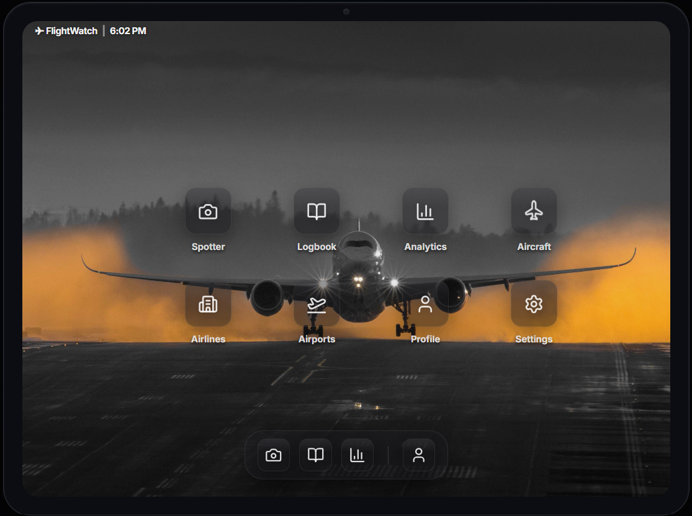
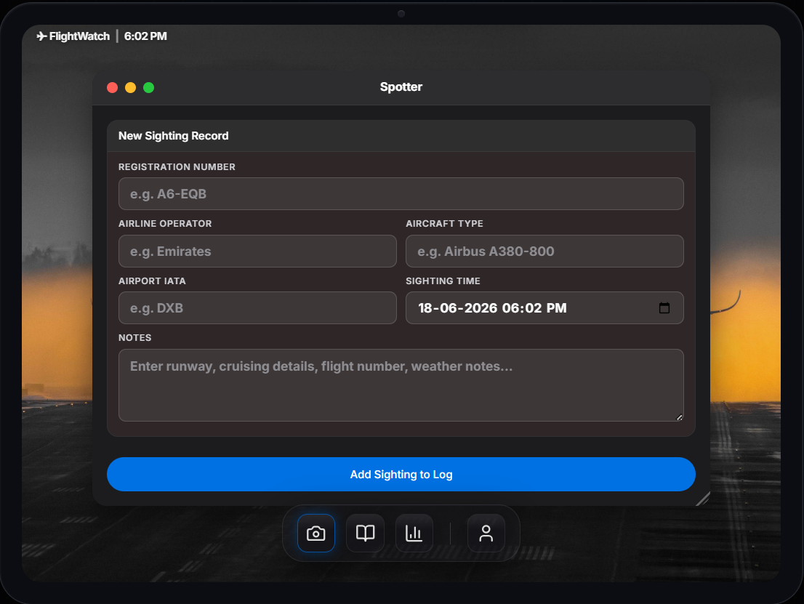
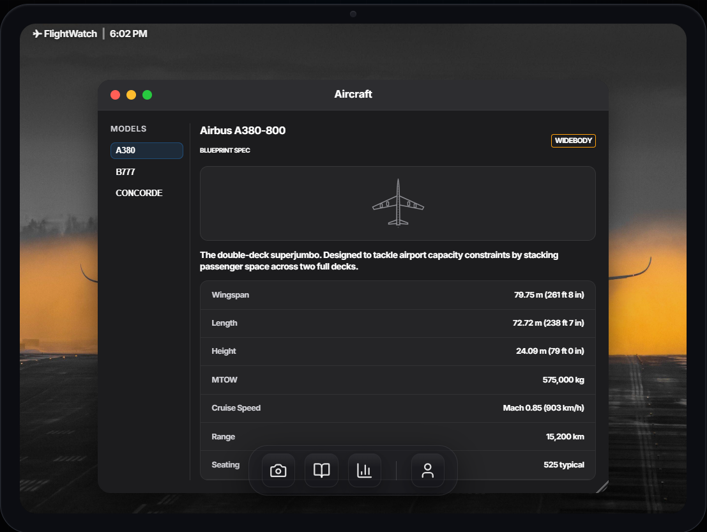
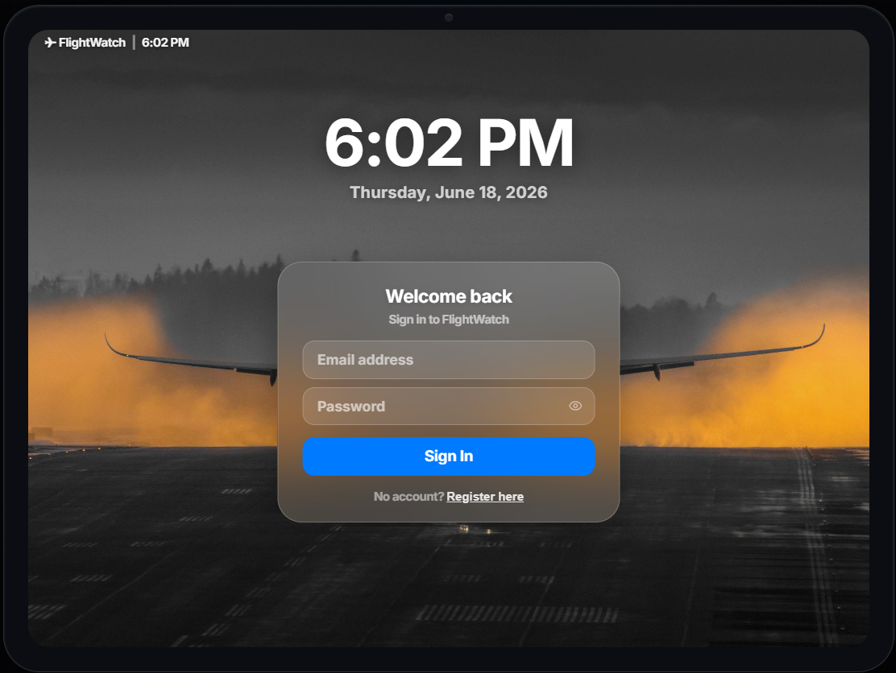
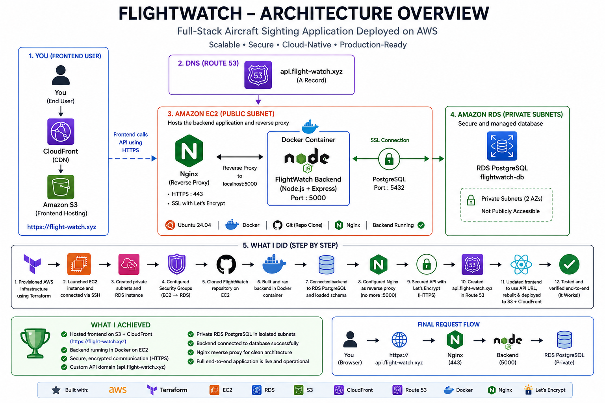

# FlightWatch ✈️

FlightWatch is a full-stack cloud-native aviation tracking and analytics platform for aviation enthusiasts to record, manage, and analyze aircraft sightings through a modern web application. Users can securely create accounts, authenticate via JWT, log aircraft sightings, and access aviation data through a responsive React/Vite interface.

🔗 **Live demo:** [https://flight-watch.xyz](https://flight-watch.xyz)

---

## Screenshots

| | |
|---|---|
|  |  |
|  |  |

---

## Features

- Log and track aircraft sightings with timestamps and location data
- Integration with external aviation data APIs for live aircraft information
- JWT-based user registration and authentication with bcryptjs password hashing
- Persistent sighting history backed by PostgreSQL on Amazon RDS
- Responsive React/Vite frontend with fast global delivery via CloudFront
- Fully automated CI/CD — push to GitHub, everything else is handled automatically

---

## Tech Stack

**Frontend**
- React + Vite
- Hosted on S3, delivered globally via CloudFront

**Backend**
- Node.js + Express (RESTful APIs)
- Dockerized, deployed on EC2
- Nginx as a reverse proxy
- Let's Encrypt SSL certificate

**Database**
- PostgreSQL on Amazon RDS (private subnet)

**Infrastructure**
- Terraform (Infrastructure as Code)
- Docker & Docker Compose
- GitHub Actions CI/CD

---

## Architecture



The frontend is hosted on S3 and globally distributed through CloudFront for low-latency delivery. The backend runs as a Docker container on EC2 behind an Nginx reverse proxy secured with a Let's Encrypt SSL certificate. PostgreSQL runs on RDS inside private subnets with no public access — only the backend EC2 instance can reach it via security group rules. Route 53 manages DNS for the custom domain and API subdomain. All infrastructure is provisioned with Terraform, and deployments are fully automated through GitHub Actions.

---

## AWS Services Used

- EC2
- RDS (PostgreSQL)
- S3
- CloudFront
- ECR (Elastic Container Registry)
- Route 53
- ACM (Certificate Manager)
- VPC, Subnets, Internet Gateway, Route Tables
- Security Groups
- IAM Roles & Instance Profiles

---

## CI/CD Pipeline

FlightWatch uses two independent GitHub Actions workflows — one for the backend and one for the frontend. Every push to `main` triggers both.

### Backend Pipeline

```
Push to main
  → Checkout code
  → Authenticate with AWS (IAM credentials via GitHub Secrets)
  → Build Docker image from backend source
  → Push image to Amazon ECR
  → SSH into EC2
  → EC2 authenticates with ECR via IAM Role & Instance Profile
  → Pull latest image
  → Stop & remove running container
  → Launch new container with .env and restart policy
  → Backend connects to RDS PostgreSQL in private subnet
```

### Frontend Pipeline

```
Push to main
  → Checkout code
  → Install dependencies
  → Vite production build → dist/
  → Upload dist/ to S3
  → Invalidate CloudFront cache
  → Users receive latest version immediately
```

---

## Infrastructure (Terraform)

All AWS resources are defined as code in the `infrastructure/` directory:

- VPC with public and private subnets
- Route tables and Internet Gateway
- Security groups (EC2, RDS, CloudFront)
- EC2 instance with IAM Role and Instance Profile
- RDS PostgreSQL instance (private subnet)
- S3 bucket (static website hosting)
- CloudFront distribution
- IAM roles and policies

```bash
cd infrastructure
terraform init
terraform plan
terraform apply
```

---

## Security

- **JWT authentication** for all protected API routes
- **bcryptjs** for password hashing
- **Security groups** restrict RDS access to the EC2 backend instance only
- **IAM roles** with least-privilege policies; no long-lived credentials on EC2
- **Private subnets** for the database — not publicly accessible
- **Environment-based configuration** via `.env` files, never committed to source control

---

## Getting Started (Local Development)

### Prerequisites
- Node.js (v18+)
- Docker & Docker Compose
- PostgreSQL (or use the provided Docker container)

### Setup

1. Clone the repository
   ```bash
   git clone https://github.com/<your-username>/flightwatch.git
   cd flightwatch
   ```

2. Set up environment variables
   ```bash
   cp .env.example .env
   # Fill in your database credentials and API keys
   ```

3. Start the application with Docker Compose
   ```bash
   docker-compose up --build
   ```

4. Frontend: `http://localhost:3000` — Backend API: `http://localhost:5000`

---

## Challenges Solved

### bcrypt Docker Issue

**Problem:** `bcrypt_lib.node: Exec format error`

**Cause:** Windows-compiled `node_modules` were copied into the Linux container.

**Solution:** Excluded `node_modules` from the Docker build context so dependencies are compiled inside the Linux container.

---

### RDS SSL Connection Issue

**Problem:** `no pg_hba.conf entry for host ...`

**Cause:** RDS requires encrypted connections by default.

**Solution:** Enabled SSL support in the PostgreSQL connection configuration.

---

## Key Learnings

- Infrastructure as Code with Terraform
- VPC design — public/private subnets, route tables, Internet Gateway
- Security groups and IAM least-privilege access
- Docker containerization and ECR image management
- CI/CD automation with GitHub Actions (build, push, deploy, invalidate)
- PostgreSQL on RDS in private subnets
- Nginx reverse proxy and SSL/TLS configuration
- DNS management with Route 53
- CloudFront content delivery and cache invalidation
- JWT authentication and secure API design
- Production debugging and real-world infrastructure troubleshooting

---

## Future Improvements

- AWS Secrets Manager for credential management
- CloudWatch monitoring and alerting
- Application Load Balancer
- ECS/Fargate migration
- Infrastructure modularization
- Enhanced analytics dashboard

---

